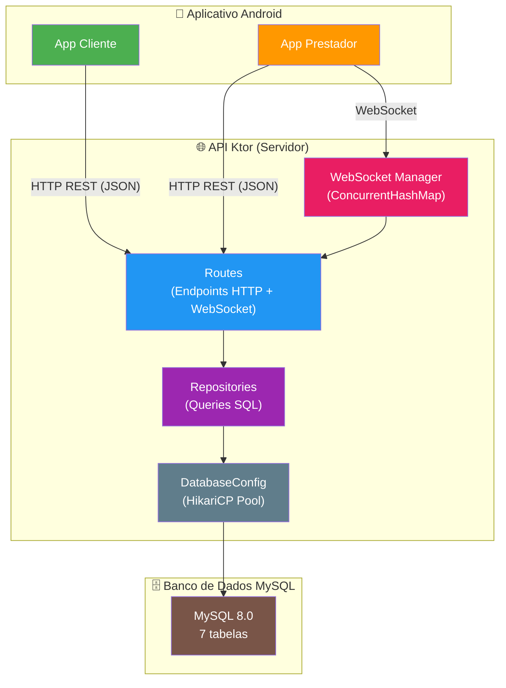
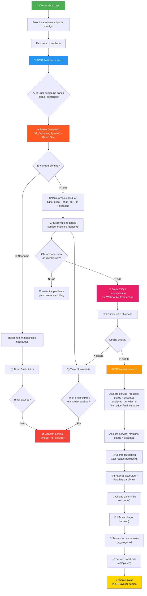
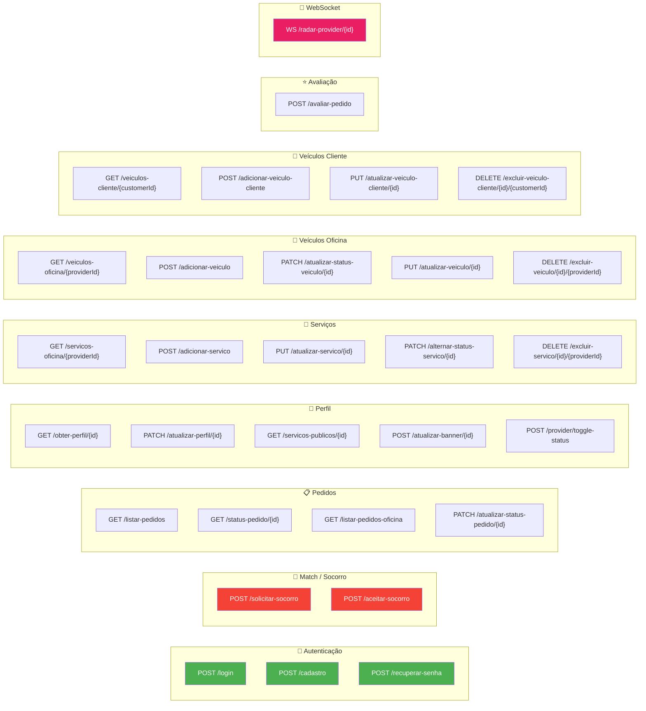
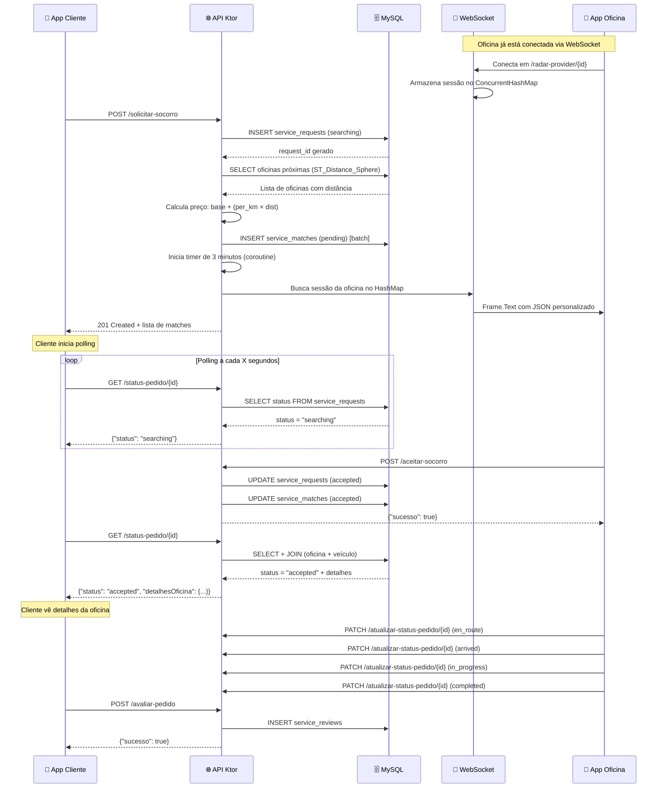
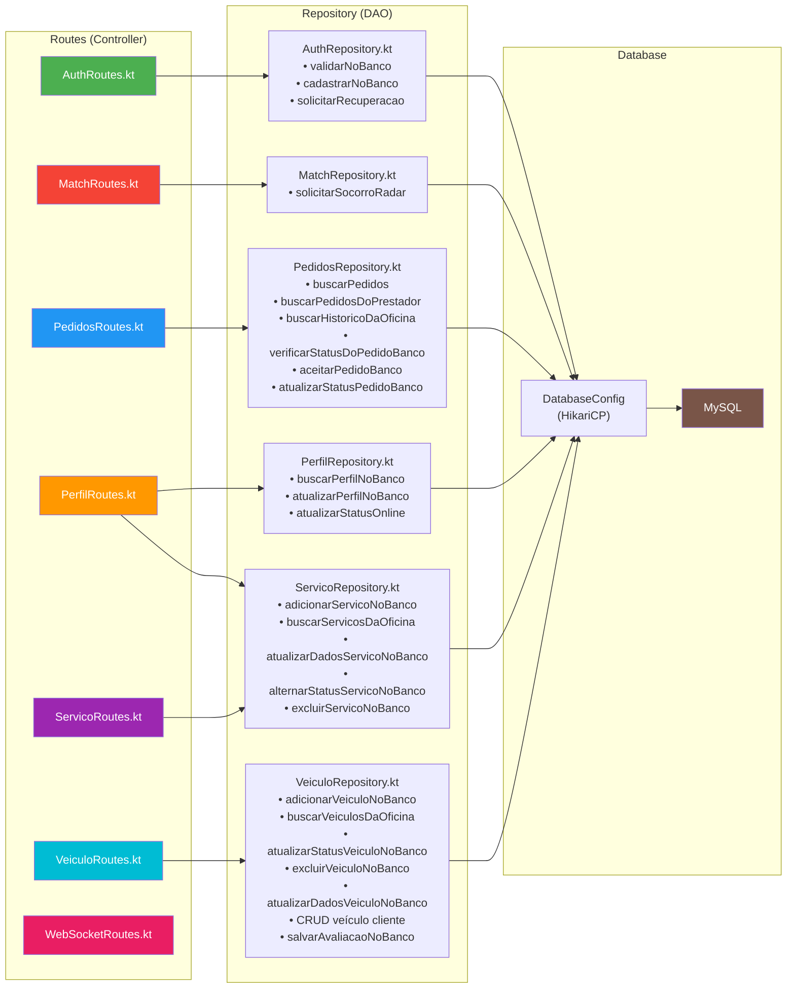
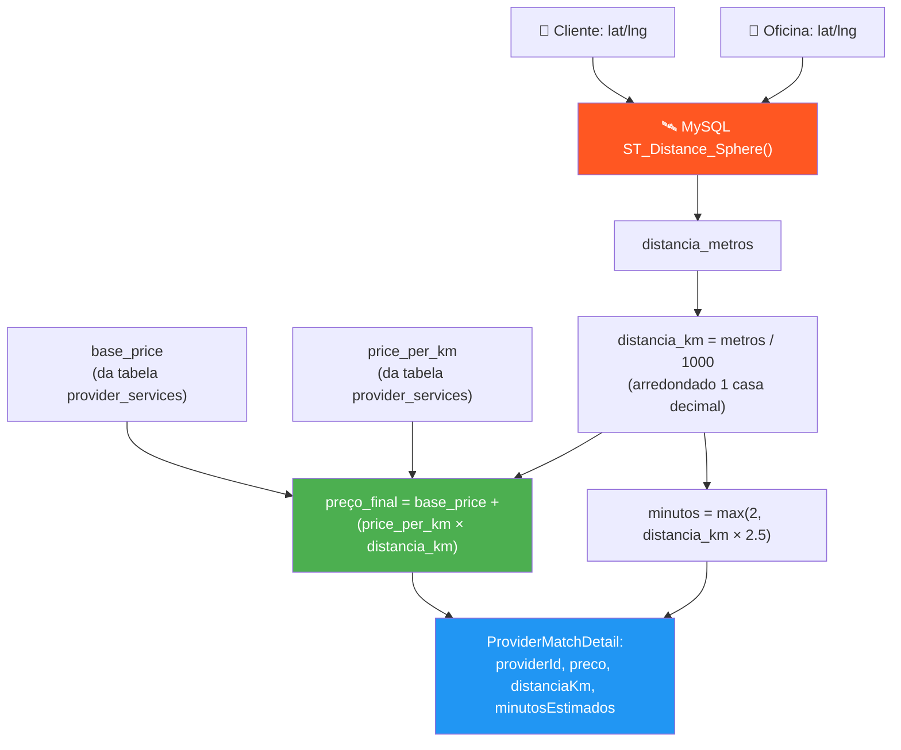

# 📐 Fluxogramas — API Salvo

> Diagramas visuais completos do projeto para entendimento do fluxo de dados, arquitetura e relacionamentos.

---

## 1. Arquitetura Geral do Sistema



---

## 2. Diagrama de Entidade-Relacionamento (ER)

```mermaid
erDiagram
    users ||--o{ service_requests : "cria (customer)"
    users ||--o{ service_requests : "aceita (provider)"
    users ||--o| provider_profiles : "tem perfil"
    users ||--o{ provider_services : "oferece"
    users ||--o{ provider_vehicles : "possui"
    users ||--o{ customer_vehicles : "possui"
    users ||--o{ service_reviews : "avalia (customer)"
    users ||--o{ service_reviews : "recebe (provider)"

    service_requests ||--o{ service_matches : "gera convites"
    service_requests ||--o| service_reviews : "recebe avaliacao"
    customer_vehicles ||--o{ service_requests : "vinculado ao pedido"
    provider_vehicles ||--o{ service_requests : "usado no atendimento"

    users {
        int user_id PK
        string user_name
        string user_email
        string user_password
        string user_cpf_cnpj
        string user_phone
        string user_role
        string user_address
        string user_banner
        double latitude
        double longitude
    }

    provider_profiles {
        int provider_id PK_FK
        boolean is_receiving_requests
    }

    provider_services {
        int id PK
        int provider_id FK
        string service_type
        double base_price
        double price_per_km
        boolean is_active
    }

    provider_vehicles {
        int id PK
        int provider_id FK
        string name
        string plate
        string status
        string vehicle_photo
        string brand
        string vehicle_type
        boolean is_active
    }

    customer_vehicles {
        int id PK
        int customer_id FK
        string brand
        string model
        string plate
        string color
        string year
        boolean is_active
    }

    service_requests {
        int id PK
        int customer_id FK
        int vehicle_id FK
        string service_type
        string description
        double location_lat
        double location_lng
        string status
        int assigned_provider_id FK
        int provider_vehicle_id FK
        double final_price
        double final_distance
        string cancellation_reason
    }

    service_matches {
        int id PK
        int request_id FK
        int provider_id FK
        string status
    }

    service_reviews {
        int id PK
        int request_id FK
        int customer_id FK
        int provider_id FK
        int rating
        string comment
    }
```

---

## 3. Fluxo Completo — Solicitação de Socorro

Este é o fluxo principal da aplicação, de ponta a ponta:



---

## 4. Máquina de Estados — Status do Pedido

```mermaid
stateDiagram-v2
    [*] --> searching : POST /solicitar-socorro

    searching --> accepted : Oficina aceita<br/>POST /aceitar-socorro
    searching --> canceled : Timeout 3 min<br/>ou cancelamento

    accepted --> en_route : Oficina saiu<br/>PATCH /atualizar-status-pedido
    
    en_route --> arrived : Oficina chegou<br/>PATCH /atualizar-status-pedido
    
    arrived --> in_progress : Serviço iniciado<br/>PATCH /atualizar-status-pedido
    
    in_progress --> completed : Serviço finalizado<br/>PATCH /atualizar-status-pedido

    accepted --> canceled : Cancelamento
    en_route --> canceled : Cancelamento
    
    completed --> [*]
    canceled --> [*]

    note right of searching : Cliente faz polling em<br/>GET /status-pedido/{id}
    note right of canceled : cancellation_reason:<br/>timeout_no_provider<br/>ou motivo manual
```

---

## 5. Fluxo de Autenticação

```mermaid
flowchart TD
    subgraph "📝 Cadastro"
        C1["App envia dados<br/>POST /cadastro"] --> C2["API hasheia senha<br/>com BCrypt"]
        C2 --> C3["Insere na tabela users"]
        C3 --> C4{"Role = provider?"}
        C4 -- "Sim" --> C5["Cria registro em<br/>provider_profiles<br/>(offline por padrão)"]
        C4 -- "Não" --> C6["Retorna userId + nome + role"]
        C5 --> C6
    end

    subgraph "🔑 Login"
        L1["App envia email + senha<br/>POST /login"] --> L2["Busca user por email"]
        L2 --> L3{"Encontrou?"}
        L3 -- "Não" --> L4["❌ Email ou senha incorretos"]
        L3 -- "Sim" --> L5["BCrypt.checkpw()"]
        L5 --> L6{"Senha confere?"}
        L6 -- "Não" --> L4
        L6 -- "Sim" --> L7["✅ Retorna userId + nome + role"]
    end

    subgraph "🔒 Recuperar Senha"
        R1["POST /recuperar-senha"] --> R2{"Email existe<br/>no banco?"}
        R2 -- "Sim" --> R3["✅ Email de recuperação enviado<br/>(stub - não envia de fato)"]
        R2 -- "Não" --> R4["❌ Email não encontrado"]
    end

    style C5 fill:#FF9800,color:#fff
    style L7 fill:#4CAF50,color:#fff
    style L4 fill:#f44336,color:#fff
```



---

## 6. Mapa Completo de Rotas



---

## 7. Diagrama de Sequência — Fluxo de Match com WebSocket



---

## 8. Fluxo de Dados — Routes → Repository → Database



---

## 9. Fórmula do Radar — Cálculo de Preço e Distância



> **Exemplo prático:**  
> - `base_price` = R$ 50,00  
> - `price_per_km` = R$ 5,00  
> - `distância` = 7,3 km  
> - **Preço final** = 50 + (5 × 7,3) = **R$ 86,50**  
> - **Tempo estimado** = max(2, 7,3 × 2,5) = **~18 min**
